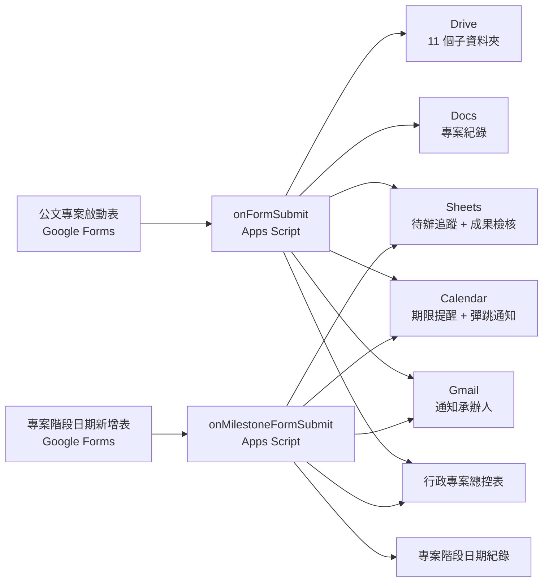

# 學校行政專案工作流

> 讓每一份公文，從進來那一刻起，就有一個清楚的家。

---

## 你是不是也遇過這些事

公文在信箱裡，附件在下載資料夾，照片在手機裡，會議紀錄在 LINE 裡，經費資料在另一個 Excel 裡——
最後要寫成果報告時，才開始到處找資料。

這個工具想做的事，就是讓**每一份公文，從填一張表開始，就被轉換成一個可以追蹤、可以整理、可以交接、可以累積成果的行政專案**。

---

## 它能幫你做什麼

承辦人填一張表 → 5 秒內，系統自動替你做好這些事：

- **11 個標準化的 Drive 子資料夾**（原始公文、計畫書、會議紀錄、表單、經費、照片、成果…）
- **一份專案紀錄 Docs**（套好範本，直接填）
- **一份待辦追蹤表**（含預設任務）
- **一份成果檢核表**
- **Calendar 期限提醒**（會跳通知，不是只記在日曆裡）
- **寄通知信給承辦人**
- **寫進總控表**（一案一列，方便交接）

之後活動辦完、又收到階段日期，再填一張小表，就能繼續加：

- 報名截止日、採購期限、成果送出日…
- 每個都自動進 Calendar、寫進待辦表
- 一個專案能持續累積到結案

---

## 看一眼成果

> 📸 **截圖待補**：本 fork 從 personal-playbook 治理層 dogfood 而成，**實際截圖需要先在你的 Google Workspace 安裝完才能產生**。
>
> 等不及看實際樣子？請看完整去識別化範例：[**examples/115-itgroup-ai-training/**](./examples/115-itgroup-ai-training/)
> 該範例詳實呈現從填表 → 自動建好的資料夾 → 待辦表 → 成果報告的全部 7 個產出檔案。

---

## 5 分鐘安裝

詳細步驟請看 **[docs/00-quickstart.md](./docs/00-quickstart.md)**，這裡先給你一張地圖：

1. 在 Google Drive 建一個總資料夾
2. 開啟 Google Apps Script，貼上 `src/Code.gs`
3. 修改檔案最上面的 4 行設定（Drive ID、Calendar ID、Admin Email、時區）
4. 執行 `setupAdminWorkflow()`，完成授權
5. 從 Logger 取得兩張表單網址，分享給承辦人

---

## 系統架構

更深入的架構說明請看 [docs/01-architecture.md](./docs/01-architecture.md)。

---

## 設計原則

這個系統**只做機器擅長的事**：建檔、追蹤、提醒、整理。

正式公告、經費核銷、成果送出、對外發文、法規判斷、簽核——這些仍然由人決定。

> AI 不取代主任或承辦人做決定，而是把資料收齊、流程開好、期限提醒、文件整理與成果草稿先準備好。

---

## 文件導覽

依角色找文件：

| 你是 | 從這裡開始 |
|---|---|
| 主任 / 組長（要決定要不要導入） | [常見問題（給主任的 10 題）](./docs/07-faq-for-principals.md) |
| 承辦人（要學怎麼用） | [5 分鐘安裝指南](./docs/00-quickstart.md) |
| IT / 工程師（要懂內部運作） | [系統架構](./docs/01-architecture.md) |
| 講師（要在研習用） | [教材 lessons/](./lessons/README.md) |
| 想看實際範例 | [examples/](./examples/) |

完整文件清單：

- [00-quickstart.md](./docs/00-quickstart.md) — 5 分鐘安裝指南
- [01-architecture.md](./docs/01-architecture.md) — 系統架構與資料流
- [02-form-fields.md](./docs/02-form-fields.md) — 表單欄位說明
- [03-testing.md](./docs/03-testing.md) — 測試流程與驗收標準
- [04-troubleshooting.md](./docs/04-troubleshooting.md) — 常見錯誤排解
- [05-uninstall.md](./docs/05-uninstall.md) — 重置與移除
- [06-privacy-template.md](./docs/06-privacy-template.md) — 隱私說明範本（給主任）
- [07-faq-for-principals.md](./docs/07-faq-for-principals.md) — 給主任的 FAQ

---

## 開發脈絡

本 fork 由 **許士彥（Hsu Shih-Yen，<https://github.com/seyen37>）**重新設計與開發。

開發歷程：

- **階段 1**：審查原作 mihozip/google-workspace-admin-project-workflow，整理 24 條優化建議
- **階段 2**：依 [personal-playbook §5.9 QODA 協定](./docs/PROJECT_PLAYBOOK.md)走三輪決策對齊（結構主軸、目錄結構、執行節奏）
- **階段 3**：分四階段重新設計（P1 骨架 → P2 文件 → P3 程式 → P4 教材＋範例＋貢獻規範）
- **Phase 2.5**：套用 [personal-playbook](./docs/PROJECT_PLAYBOOK.md) 治理 SOP，補齊第一天清單缺漏

詳細決策脈絡見 [`docs/decisions/`](./docs/decisions/) — 每個關鍵設計決定都有對應的決策日誌，記錄當時遇到的選項、考量與最終解法。

---

## 致謝

本專案 fork 自 **[mihozip/google-workspace-admin-project-workflow](https://github.com/mihozip/google-workspace-admin-project-workflow)**（作者 Albert Peng），在原作基礎上做了重新設計與功能擴充。完整致謝請看 [ACKNOWLEDGEMENTS.md](./ACKNOWLEDGEMENTS.md)。

---

## 透明度聲明

> 記錄本 repo 已知的歷史 trade-off 與設計選擇，方便讀者追溯。

- **本 fork 與原作的關係**：fork 自 mihozip 公開的 MIT License repo。原作的設計概念（公文→自動建專案→追蹤→成果、11 個資料夾命名、雙表單架構、人機分工原則）完整繼承；本 fork 的擴充範圍見 [ACKNOWLEDGEMENTS.md](./ACKNOWLEDGEMENTS.md)。
- **與 personal-playbook 的關係**：本 repo 套用 [`docs/PROJECT_PLAYBOOK.md`](./docs/PROJECT_PLAYBOOK.md) 治理 SOP（決策日誌、工作紀錄、身份鏈、公開前審查）。PROJECT_PLAYBOOK.md 是維護者個人的 source-of-truth 文件、抄入本 repo 0 修改、亦遵循 MIT License。
- **個資保護**：本 repo 不接觸學生個資。承辦人姓名與 Email 用於系統通知，存放於使用者自有 Google Workspace 帳號內，不外傳。詳見 [docs/06-privacy-template.md](./docs/06-privacy-template.md)。
- **正體中文台灣詞彙**：本 repo 文件以正體中文台灣詞彙撰寫；程式碼註解亦同。國際 contributors 歡迎用英文提 issue，維護者會以中英雙語回應。

---

## 注意事項

**請勿把下列資訊提交到公開 GitHub repo：**

- 真實的 Drive Folder ID、Calendar ID
- 學校帳號、學生資料
- 公文附件
- 任何個資

`src/config.example.gs` 提供設定範本；真正的設定請寫在你自己的 Apps Script 專案內，不要 commit。

---

## License

MIT — 詳見 [LICENSE](./LICENSE)。

原作 © 2025 Albert Peng (mihozip)
修改 © 2026 本 repo 維護者

---

## 路線圖

- [x] P1：repo 骨架、README、致謝、LICENSE
- [ ] P2：完整 docs/ 八份文件
- [ ] P3：Apps Script 重構（dedupe、彈跳提醒、多日曆、人類友善流水號…）
- [ ] P4：教材重新編排、去識別化範例、貢獻規範
- [ ] P5：最終驗證、可 push 上 GitHub
