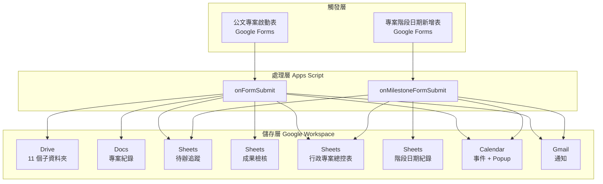

# 系統架構

本文件給 IT、工程師、想懂內部運作的人。如果你只是要使用，看 [00-quickstart.md](./00-quickstart.md) 就好。

---

## 1. 整體資料流



關鍵特性：

- **兩個觸發器各管一張表單**，職責不重疊
- **所有資料都在使用者自己的 Google Workspace 內**，本系統沒有任何外部伺服器
- **Apps Script 是無伺服器執行**，免費額度內個學校綽綽有餘

---

## 2. 兩個觸發器的職責分工

### `onFormSubmit` — 建立新專案

當「公文專案啟動表」被填寫送出時觸發。

**做的事：**

1. 解析表單欄位
2. 驗證必填欄位
3. 生成人類友善的 ProjectCode（例：`115-教務-001`）
4. **去重檢查**：相同 `(年度, 處室, 專案名稱)` 的專案是否已存在
5. 在 `03_專案資料夾` 下建立新專案資料夾
6. 建立 11 個子資料夾
7. 建立專案紀錄 Docs（依模板）
8. 建立待辦追蹤表（含 10 項預設任務）
9. 建立成果檢核表（含 10 項預設項目）
10. 建立 Calendar 事件（活動日、成果期限、經費期限 + 各自的彈跳提醒）
11. 寫入行政專案總控表
12. 寄通知信給承辦人

**不做的事：**

- 不上傳公文附件（承辦人事後自己丟到 `00_原始公文與附件`）
- 不自動建 NotebookLM 筆記本（NotebookLM 沒有 API）

### `onMilestoneFormSubmit` — 為既有專案加日期

當「專案階段日期新增表」被填寫送出時觸發。

**做的事：**

1. 解析表單，驗證必填
2. 在總控表中查找 ProjectCode
3. 若找不到 → 寫入「階段日期紀錄」標記為錯誤、寄錯誤通知
4. 若找到：
   - 在「階段日期紀錄」新增一列（永久保存）
   - 在該專案的待辦追蹤表新增一項
   - 在 Calendar 建立事件 + 依使用者勾選建立 popup/email reminder
   - 寄通知給負責人

---

## 3. Drive 資料夾命名規約

每個專案資料夾固定產生這 11 個子資料夾，**順序與編號刻意設計**：

| 編號 | 名稱 | 用途 |
|---|---|---|
| 00 | 原始公文與附件 | 公文 PDF、來文掃描、附件原檔 |
| 01 | 計畫書與核定資料 | 校內計畫書、核定函、簽呈 |
| 02 | 工作分工與會議紀錄 | 籌備會議、工作分配 |
| 03 | 表單與回覆資料 | 報名表、家長同意書、回覆統計 |
| 04 | 經費與採購核銷 | 預算表、估價單、發票、核銷單 |
| 05 | 活動照片與照片說明 | 照片原檔 + 照片說明.docx |
| 06 | 成果資料與成果報告 | 成果報告草稿、定稿、附件 |
| 07 | 公告通知與對外文字 | 校內公告、新聞稿、Line 訊息 |
| 08 | 簡報與成果展示 | PPT、海報、展示物 |
| 09 | 檢討與下次改進 | 檢討會議、下次注意事項 |
| 99 | 系統產生文件 | 專案紀錄 Docs、待辦表、檢核表（系統建立的東西放這裡，避免污染前面 9 個資料夾） |

**為什麼這樣設計：**

- `00` 是公文（最重要的依據）
- `01–09` 對應行政工作的**時間順序**（計畫→分工→執行→核銷→成果→公告→簡報→檢討）
- `99` 故意放最後，**讓系統自動產生的東西不會干擾承辦人的視覺**
- 編號用兩位數，方便對齊排序

---

## 4. 試算表結構

### 行政專案總控表（一個檔案）

**欄位：**

| 欄位 | 說明 |
|---|---|
| 專案編號 | 主鍵，例：`115-教務-001` |
| 專案名稱 | |
| 年度 | |
| 承辦處室 | 影響多日曆派發 |
| 承辦人 | |
| 承辦人Email | |
| Drive資料夾連結 | 直接跳到專案資料夾 |
| 專案紀錄Docs連結 | |
| 待辦追蹤表連結 | |
| 成果檢核表連結 | |
| NotebookLM筆記本連結 | 承辦人手動貼上 |
| 專案狀態 | 籌備中 / 執行中 / 結案 / 暫停 |
| 備註 | |
| 來文單位 / 公文文號 / 建立日期 / 活動日期 / 成果期限 / 經費期限 / 是否有經費 | |

### 階段日期紀錄（同一個檔案的另一張工作表）

**欄位：**

| 欄位 | 說明 |
|---|---|
| 紀錄編號 | `M-yyyyMMdd-HHmmss` |
| 新增時間 | |
| 建立者Email | |
| 專案編號 | 對應總控表 |
| 專案名稱 | |
| 日期類型 | 14 種，見 [02-form-fields.md](./02-form-fields.md) |
| 日期 | |
| 提醒設定 | |
| 負責人 / 負責人Email | |
| 是否寫入待辦追蹤表 | |
| 是否建立Calendar提醒 | |
| 說明 | |
| Calendar事件ID | 寫入後再回填，方便刪除 |
| 待辦追蹤表連結 | |
| 狀態 | 有效 / 錯誤 / 處理中 |
| 備註 | |

### 待辦追蹤表（每專案一個）

| 欄位 | 說明 |
|---|---|
| 任務編號 | |
| 階段 | 公文 / 籌備 / 執行 / 經費 / 成果 / 結案 |
| 任務名稱 | |
| 任務說明 | |
| 負責人 / 協助單位 | |
| 期限 / 提醒日期 | |
| 狀態 | 未開始 / 進行中 / 已完成 / 已取消 |
| 需要附件 / 附件位置 / 備註 | |

### 成果檢核表（每專案一個）

| 欄位 | 說明 |
|---|---|
| 項目 | 例：原始公文、計畫書、會議紀錄 |
| 是否需要 | 是 / 建議 / 不需要 / 不確定 |
| 目前狀態 | 待整理 / 已收集 / 已歸檔 / 需補件 |
| 存放位置 | 對應 Drive 子資料夾 |
| 負責人 / 備註 | |

---

## 5. 模組分層（P3 後）

```
src/
├── Code.gs                 # 對外進入點：setupAdminWorkflow, onFormSubmit, onMilestoneFormSubmit, resetAdminWorkflow
├── config.example.gs       # 設定範本
├── appsscript.json         # OAuth scopes 宣告
└── lib/
    ├── folders.gs          # Drive 資料夾建立、命名 sanitize
    ├── forms.gs            # 兩張表單的建立 + 更新
    ├── sheets.gs           # 4 種試算表的 schema 與 CRUD
    ├── calendar.gs         # 事件 + popup reminder + 多日曆派發
    ├── notifications.gs    # Gmail 通知 + throttle
    └── utils.gs            # 共用：dedupe、流水號、日期解析、檔名 sanitize
```

**設計原則：**

- 每個 lib 只負責一種 Google Workspace 資源
- `Code.gs` 只做 orchestration，不直接呼叫 DriveApp/CalendarApp
- 對外 API 集中在 `Code.gs`，方便日後升級遷移

---

## 6. PropertiesService 儲存什麼

Apps Script 的 `PropertiesService.getScriptProperties()` 用來持久化 ID，避免每次都查 Drive。

| Key | 用途 |
|---|---|
| `VERSION` | 當前部署版本，升級遷移用 |
| `CONTROL_SHEET_ID` | 總控表 ID |
| `STARTER_FORM_ID` | 公文專案啟動表的 Form ID |
| `STARTER_RESPONSE_SHEET_ID` | 啟動表的表單回應試算表 ID |
| `MILESTONE_FORM_ID` | 階段日期新增表的 Form ID |
| `MILESTONE_RESPONSE_SHEET_ID` | 階段表的表單回應試算表 ID |
| `LAST_ERROR_SIGNATURE_*` | 錯誤 throttle 用的「最近 10 分鐘已寄過某類錯誤」標記 |

**清除這些 Key 等於部分重置**，見 [05-uninstall.md](./05-uninstall.md)。

---

## 7. 人工確認邊界（為什麼有些事不自動化）

本系統刻意**不**做下列事情：

| 不自動化的事 | 原因 |
|---|---|
| 正式公告 | 對外文字要校長/主任核可 |
| 經費核銷 | 涉及會計、需要原始憑證 |
| 成果送出 | 上級單位要對方收件確認 |
| 對外通知 | 寄錯了無法收回 |
| 法規/個資判斷 | AI 判斷錯了責任在人 |
| 校內簽核 | 需要實體簽章流程 |

**為什麼這條界線重要：** 學校行政錯誤的代價往往不是「重做」而是「對外解釋」。AI 應該把人從重複勞動中解放，而不是讓人去解釋 AI 為什麼說錯話。

---

## 8. 配額與限制

Google Apps Script 對免費帳號的執行有以下限制（會持續變動，以 [Google 官方文件](https://developers.google.com/apps-script/guides/services/quotas) 為準）：

| 項目 | Workspace 帳號 | 一般 Gmail |
|---|---|---|
| 每天執行總時間 | 6 小時 | 6 小時 |
| 單次執行時間上限 | 6 分鐘 | 6 分鐘 |
| Gmail 每天寄信封數 | 1,500 | 100 |
| Drive 每天建立檔案數 | 250 | 250 |
| Calendar 每天建立事件數 | 10,000 | 10,000 |

**對學校的意義：** 一個專案建立會用掉約 3 個 Calendar、5 個 Drive 資源、1 封 Gmail。一天建立 30 個專案以內都不會碰到上限。
