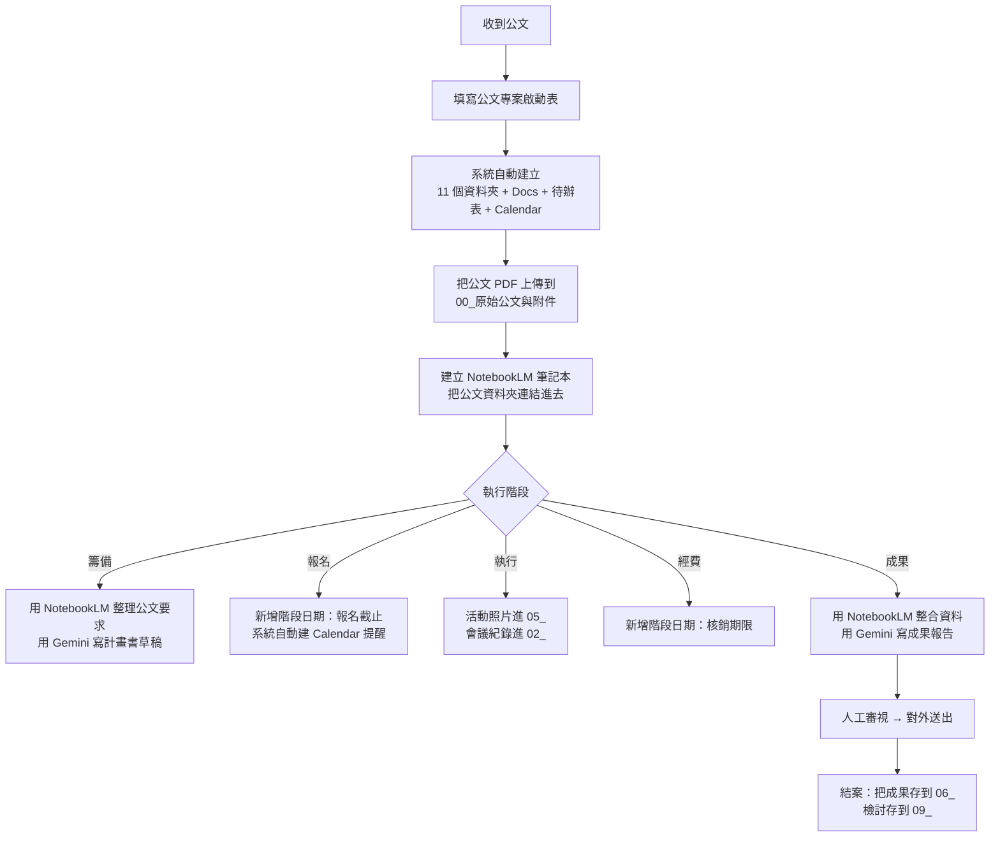

# 進階課程：行政專案全流程

> 適用對象：主任、組長、行政承辦人
> 預計學習時間：**90 分鐘**
> 前置需求：已讀完 [`basic/notebooklm-gemini-basics.md`](../basic/notebooklm-gemini-basics.md)、已安裝完 [本系統](../../docs/00-quickstart.md)

---

## 學會基礎後的下一步

基礎課程讓你能用 NotebookLM 與 Gemini 做單點任務（摘要公文、寫家長通知）。
進階課程要讓你能**用整套工作流串起整個行政專案週期**：

```
收到公文 → 填表啟動 → 自動建專案 → AI 整理脈絡 → 執行 → AI 寫成果 → 結案
```

關鍵心法：**讓「自動的」歸自動、「需要判斷的」歸 AI 草稿、「需要決定的」歸人**。

---

## 整個工作流地圖



---

## 階段 1：收到公文當天

### 動作 1：填寫公文專案啟動表

去 [公文專案啟動表](本系統的 Form 網址) 填一張表。重點欄位：

- **專案年度 / 承辦處室 / 專案名稱** — 必填，影響資料夾名與專案編號
- **承辦人 / 承辦人 Email** — 必填，通知信會寄到這
- **活動日期 / 成果繳交期限 / 經費核銷期限** — 填了會自動建 Calendar 提醒
- **是否有經費 / 是否需要照片 / 是否需要成果報告** — 影響成果檢核表的「是否需要」欄

送出後 5 秒內，你應該會：

- ✅ 收到通知 Email
- ✅ 在 Drive 看到新建的專案資料夾（11 個子資料夾都好了）
- ✅ 在總控表看到新的一列

### 動作 2：把公文 PDF 上傳

到專案資料夾的 `00_原始公文與附件`，把：

- ✅ 公文 PDF 原檔
- ✅ 附件（簽到表範本、計畫書範本、講師資料…）
- ✅ 上級單位的補充說明

全部上傳。**這是後面所有自動化的起點**。

### 動作 3：建立 NotebookLM 筆記本

到 NotebookLM 建一個新 Notebook，命名同專案名稱。加入來源：

- ✅ 把 `00_原始公文與附件` 整個資料夾**一次加入**（NotebookLM 支援 Drive 資料夾批次加入）
- ✅ 如果有歷年類似活動的成果報告，也加進來（給 AI 看「我們上次怎麼辦的」）

### 動作 4：把 NotebookLM 連結回填總控表

到行政專案總控表，找到剛建立的列，在「**NotebookLM 筆記本連結**」欄貼上你剛建的 Notebook URL。**這一步很重要**——下次你或別人接手，從總控表就能跳到 Notebook，不必到處找。

---

## 階段 2：籌備階段（事前 1-2 週）

### NotebookLM 整理公文要求

開啟你剛建的 Notebook，問它：

```
請整理這次活動的公文要求，分成「必須做」「建議做」「沒提到但通常會做」三類。
每類列 3-5 條，每條一句話。
```

NotebookLM 會根據你上傳的公文 + 附件回答，**每條都會引用來源段落**。把答案複製、貼到專案紀錄 Docs 的「四、公文要求摘要」段。

### Gemini 寫計畫書草稿

把 NotebookLM 整理好的「必須做」「建議做」清單複製，貼到 Gemini，提示：

```
你是學校行政承辦人。下面是一份活動的公文要求清單。
請依此寫一份校內計畫書草稿，包含：

1. 活動目的（50 字）
2. 辦理依據（公文文號 + 引用要點）
3. 辦理時間 / 地點 / 對象
4. 課程內容（4-6 個 30 分鐘區段）
5. 講師資格與費用編列
6. 預期成效（3-5 條，可量化）
7. 經費明細表（依公文核定金額拆分）
8. 注意事項與配套措施

字數 1500-2000 字、不要用 emoji、用標準公文格式但口語化一些。

公文要求清單：
[貼 NotebookLM 整理的清單]
```

收到 Gemini 草稿後：

1. **人工修改**——AI 寫的「預期成效」常常太抽象，需要你補真實數字
2. 存到專案資料夾的 `01_計畫書與核定資料/`
3. 在待辦追蹤表把「T003 撰寫或修正計畫書」改成「已完成」

### 用本系統新增階段日期

如果這個活動有「報名截止日」、「採購送單日」、「活動前場勘日」等中間日期，**不要等到活動當天才想起來**。

到[專案階段日期新增表](本系統的 Form 網址)，每一個重要日期都填一筆：

| 日期類型 | 日期 | 提醒設定 |
|---|---|---|
| 報名截止日 | 2026/06/10 | 前 7 天 + 前 3 天 + 當天 |
| 採購送單期限 | 2026/06/15 | 前 14 天 + 前 7 天 + 前 3 天 |
| 活動前檢查日 | 2026/06/19 | 當天 |

每填一筆，系統會：

- ✅ 建立 Calendar 事件 + 你勾選的所有 popup reminder
- ✅ 在待辦追蹤表新增對應任務
- ✅ 寄通知信給負責人

---

## 階段 3：執行階段（活動當週）

### 活動進行中

- ✅ **照片進 `05_活動照片與照片說明`**
- ✅ **簽到表掃描進 `03_表單與回覆資料`**
- ✅ **會議紀錄 / 行前協調紀錄進 `02_工作分工與會議紀錄`**

### 活動結束當天

打開待辦表，把以下任務改成「已完成」：

- T005 收集活動照片
- T006 整理簽到表或參與名冊

### 用 Gemini 寫照片說明

照片是成果報告的關鍵。用 Gemini 為每張照片寫說明：

```
請依下列照片內容寫一句說明文字，用於成果報告：
- 場景：教室裡 20 位老師圍坐
- 動作：講師示範如何用 NotebookLM
- 表情：專注、有人在抄筆記
- 時間：活動上午第二節

字數 30 字以內、客觀描述、不要主觀形容詞。
```

Gemini 通常給 3-5 個版本，**選一個最貼近的、人工微調**。

---

## 階段 4：成果報告階段（活動後 1-2 週）

這是本系統最大的價值產出時點。

### NotebookLM 整合資料

回到你的 Notebook，**這時候應該已經有以下來源**：

- 公文 + 附件（從階段 1 加入）
- 計畫書（你寫好的）
- 講師資料 / 簡報檔
- 活動照片（如果是 Google Photos 連結，也可以加入）
- 簽到表 / 參與名單
- 回饋表統計（如果有用 Google Form 收）

**問 NotebookLM 一連串問題**：

```
1. 這次活動的參與人數、滿意度如何？
2. 參與者的回饋中，有哪些共同肯定的點？有哪些建議改善的點？
3. 相較於計畫書原訂目標，實際達成了哪些？哪些沒達成？為什麼？
4. 講師的回饋意見有什麼可以納入下次籌備？
5. 這次經費執行有沒有跟原訂預算偏差？為什麼？
```

把答案複製、整理成「成果要點筆記」。

### Gemini 寫成果報告

把成果要點筆記貼到 Gemini，提示：

```
你是學校行政承辦人。下面是一次研習活動的執行摘要。
請寫一份成果報告，符合台灣公立學校行政文書格式：

1. 活動概述（活動名稱、時間、地點、對象、人數）
2. 辦理情形（依時間順序，描述上午、下午各做了什麼）
3. 執行成效（依參與人數、滿意度、目標達成度三個維度）
4. 反思與建議（次數可累積到後續活動的改善建議）
5. 經費執行情形（總預算、實際執行、差異說明）
6. 附件清單（照片、簽到表、回饋表等）

字數 1500-2000 字、語氣中性正式、引用實際數字、不用 emoji。

執行摘要：
[貼成果要點筆記]
```

收到草稿後：

1. **人工核對所有數字**（AI 偶爾會把「48 人」說成「45 人」）
2. **核對人名與職稱**
3. **核對日期**（這是 AI 最容易出錯的地方）
4. 存到 `06_成果資料與成果報告/`

### 把成果報告連回到總控表

在總控表那一列補上：

- **專案狀態** → 改成「執行中」或「成果撰寫中」
- **備註** → 加上「成果報告草稿已完成，待主任核可」

---

## 階段 5：結案

### 對外送出之前的最後檢查

去待辦表，**所有「成果」階段的任務都要打勾**：

- T008 撰寫成果報告草稿 ✅
- T009 檢查成果附件是否齊全 ✅

去成果檢核表，**所有「是否需要」=「是」的項目，狀態要是「已收集」或「已歸檔」**：

- 原始公文 ✅
- 計畫書 ✅
- 簽到表 ✅
- 經費明細 ✅
- 活動照片 ✅
- 成果報告 ✅

任何一個沒打勾、沒收齊，**先不要送出**。

### 用 Gemini 寫對外公告

成果送出後，可以順手請 Gemini 寫一段對外公告（給校網、Line 群組、家長日報用）：

```
請把下列研習活動寫成一段 200 字的校網公告。
目標讀者：學生家長與一般民眾。
語氣：分享成果、不要技術性、避免行政術語。

成果報告摘要：
[貼成果報告的「執行成效」段]
```

⚠️ **對外公告要主任核可**才能發。

### 結案檢討

到 `09_檢討與下次改進/`，建立一份 `下次辦理建議.md`，問 Gemini：

```
基於這次活動的成果報告，如果明年要再辦類似活動，請給：

1. 沿用的部分（什麼做得好，下次照樣做）
2. 改進的部分（什麼可以更好，怎麼改）
3. 避免的部分（什麼踩到雷，下次別這樣）
4. 新嘗試的部分（這次沒試但下次可以的）

每項列 2-3 條，依重要度排序。

成果報告：
[貼成果報告全文]
```

把答案存到 `下次辦理建議.md`。

**明年新承辦人接手時**，從這份檔案開始讀，比從零摸索快得多。這就是「**結案資料是下一輪的起點**」的真實意義。

---

## 接手別人的專案

如果你是中途接手別人的專案，請依以下順序看：

1. **行政專案總控表**那一列 → 知道專案編號、活動日、期限、目前狀態
2. **NotebookLM 筆記本連結** → 用 AI 對話快速了解專案脈絡（問「給我這個專案的 3 句話摘要」）
3. **專案紀錄 Docs** → 看「四、公文要求摘要」與「五、執行紀錄」
4. **待辦追蹤表** → 看還有什麼沒做、誰負責、什麼時候到期
5. **成果檢核表** → 看哪些資料還沒收齊
6. **`00_原始公文與附件`** → 看公文原文確認自己理解對

整套流程**接手者 1 小時內可以掌握全貌**。

---

## 進階：用本系統 + AI 工具的工作節奏

對於同時負責 3-5 個專案的承辦人，建議的每週節奏：

| 時段 | 動作 |
|---|---|
| 週一早上 30 分鐘 | 打開總控表 → 看本週到期的階段日期（Calendar 也會提醒）→ 列本週 to-do |
| 每天工作前 10 分鐘 | 看 Calendar 今天有什麼提醒 → 確認是否處理 |
| 週五下午 30 分鐘 | 更新各專案的待辦表狀態 → 檢視成果檢核表是否有「需補件」 |
| 月底 1 小時 | 把當月結案的專案完成「檢討與下次改進」筆記 |

---

## 重要提醒

> **AI 不替你做決定**。
>
> 即使是進階使用者，這條原則不變。
>
> AI 寫的所有東西——計畫書、照片說明、成果報告、對外公告——都必須**人工審視**才能對外送出。
>
> AI 的價值不是省去判斷，是把判斷的對象從「白紙」變成「有結構的草稿」，讓你能聚焦在「**這份東西我同意送出嗎**」這個真正屬於人的決定上。
